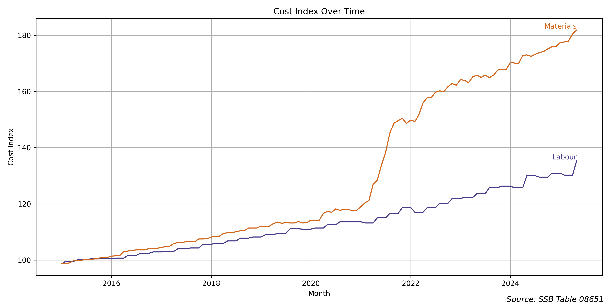

# Economic report
This is an economic report prepared by the Chief Economist in Ekle Economics. As a good economist, I consider data as an important factor in my analysis. The way I work is that I look at the building cost index from [SSB TABLE 08651](https://www.ssb.no/statbank/table/08651). The labour cost is a good proxy for the economic situatuion in Norway and the materials cost is a good proxy for the global economic situation. I use these two indices to assess the economic situation in Norway and the world. But using two time series is often not enough, so I also look at the latest Pengepolitisk Rapport from Norges Bank. This report is written by very good economists and gives a good overview of the economic situation in Norway. I use this report to correct my own initial assessment based on the building cost index. 

# Initial report based on building cost index

The last years of data can be seen in the chart below.

#### Report generated 2025-07-10 11:14

## Macroeconomic Commentary on Norway

### Overview

Norway's economic landscape is currently facing contrasting pressures from international and domestic fronts. The data for materials, representing international economic conditions, indicates a persistent upward trend. On the other hand, domestic labor conditions are also showing signs of increasing pressure, albeit slightly more subdued than materials.

### Materials (International Conditions)

The year-over-year change in materials prices has been on a consistent rise:

- **January 2025**: 4.2%
- **February 2025**: 4.4%
- **March 2025**: 4.6%
- **April 2025**: 4.5%
- **May 2025**: 5.1%

This persistent increase underscores heightened global inflationary pressures, likely driven by supply chain challenges and escalating commodity prices. Such international dynamics are critical as they feed into domestic production costs and consumer prices.

### Labour (Domestic Conditions)

The labor market, reflecting domestic economic conditions, shows the following year-over-year changes:

- **January to April 2025**: Stable at 3.6%
- **May 2025**: Increased to 4.1%

The stability observed earlier in the year has given way to a noticeable uptick in May. This suggests growing wage pressures, which could be attributed to tightening labor markets or negotiated wage hikes. Such domestic inflation drivers, if persistent, can significantly influence the cost of living and domestic demand.

### Implications for Norges Bank's Interest Rate Decisions

Norges Bank is targeting a 2% year-over-year price increase, but the current data presents a challenging scenario:

1. **Materials Inflation**: The upward trajectory in materials costs is a clear signal of imported inflation. This could push the overall inflation rate higher, moving away from the target.

2. **Labor Market Pressures**: The recent rise in labor costs adds to the inflationary pressure from within the economy. If this trend continues, it risks entrenching inflation expectations among households and businesses.

### Conclusion

Given the dual pressures from both international and domestic fronts, Norges Bank may need to consider a more hawkish stance. The persistent inflationary pressures suggest that maintaining or increasing interest rates could be necessary to anchor inflation expectations and steer the economy towards the 2% target. However, any decision will need to carefully balance the risk of stifling economic growth against the need to control inflation. In this intricate economic environment, a steady hand at the helm is crucial.

<!-- INSERT_CHIEF_ECONOMIST_REPORT_HERE -->

# Final report

#### Report generated 2025-07-10 11:14

## Macroeconomic Commentary on Norway

### Current Economic Landscape

#### International Conditions: Materials Prices

The materials price index has exhibited a generally stable yet elevated growth pattern, with year-over-year changes hovering between 4.2% and 5.4% over the past year. Notably, there was a peak in August 2024 at 5.4%, followed by a slight decline and stabilization around the mid 4% range. The recent uptick in May 2025 to 5.1% suggests persistent upward pressure. This continued high level of material costs indicates sustained international inflationary pressures, possibly due to ongoing global supply chain constraints or robust demand dynamics.

#### Domestic Conditions: Labour Costs

Domestically, labour cost increases have shown more volatility. Initially, there was a sharp drop from 5.2% to 2.9% in August 2024, stabilizing at this lower level through October 2024. However, starting from November 2024, labour cost increases have climbed gradually, reaching 4.1% in May 2025. This trend points to a tightening labour market, perhaps due to increased economic activity or a shortage of skilled workers, which could lead to wage-push inflation.

### Implications for Norges Bank's Interest Rate Decisions

Norges Bank's primary mandate is to maintain price stability with a target inflation rate of 2%. The current economic indicators present a challenging scenario:

1. **Above-Target Inflationary Pressures**: Both international and domestic factors are contributing to inflationary pressures above the target, with materials and labour costs well over the 2% mark.

2. **Policy Considerations**: To align with their inflation target, Norges Bank may need to consider a more hawkish monetary stance. The persistent rise in input costs, both from materials and labour, could necessitate an increase in interest rates to temper demand-side inflationary pressures.

3. **Balancing Act**: However, any rate hikes must be balanced against potential adverse effects on economic growth, especially if global conditions worsen or if the domestic economy shows signs of softening in response to tighter monetary policy.

In conclusion, the data underscores a cautious yet decisive need for action by Norges Bank to ensure inflation is steered towards the target while supporting sustainable economic growth.

<!-- INSERT_HINDSIGHT_REPORT_HERE -->